**College:** College of Computing

**Department:** Software Engineering

**Program:** BSc in Human Computer Interaction

**Course Name:** User Interface Design 1 (HCI2101)

**Group Members:**

- Omar Abdulrahman Al-Qathami (ID: 445005973)

# Project Description

The project is based on the creation of an all-encompassing course site that will render the specifications of the curriculum with clarity, in an accessible and responsive way. The design is implemented according to the current web standards, containing an active changing of the theme (Light/Dark mode), bilingualism (English/ Arabic) with automatic LTR/RTL switching of text directions.

The chosen course, Advanced Interaction (HCI4303), explores the high principles of having an interactive system. It specialises in the latest interaction paradigm, which include multimodal interfaces, augmented reality (AR), virtual reality (VR) and tangible interfaces and so equip students with the knowledge to build engaging user experience.

**Link to Course Specification:**

 [HCI4303 Advanced Interaction - Course Spec PDF](https://drive.uqu.edu.sa/_/ccomp_se/files/b059b011-e9fd-457d-b88c-979f3a2c310d.pdf)

# Hand-Drawn Wireframes

The first stage in design was to come up with structural wireframes so as to plot how the elements would be distributed to various screen types. Desktop overflow with a top incessant navigation bar together with a multi-column grid with content, whereas mobile overflow with a narrow and scrollable interface with a collapsible hamburger menu.

**Desktop Screen Sketches:**

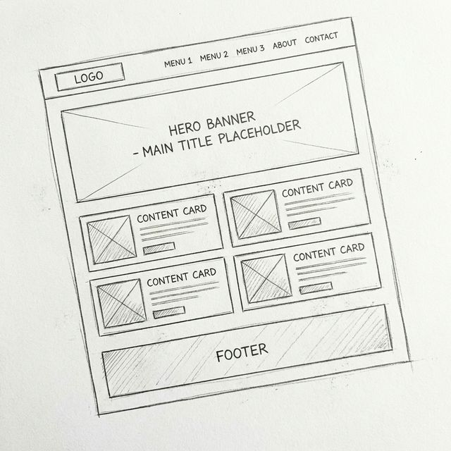{width=100%}

**Mobile Screen Sketches:**

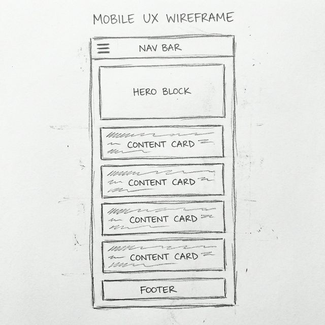{height=3.5in}

# Screenshots Before Feedback

The following images reflect the initial implementation of the course website across various themes, languages, and device form factors before any iterative feedback was applied.

**Desktop Screenshots:**

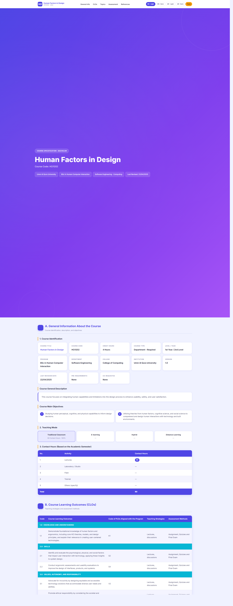{width=100%}

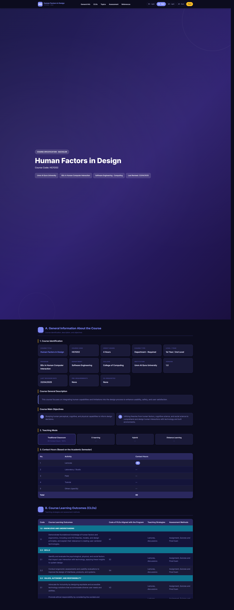{width=100%}

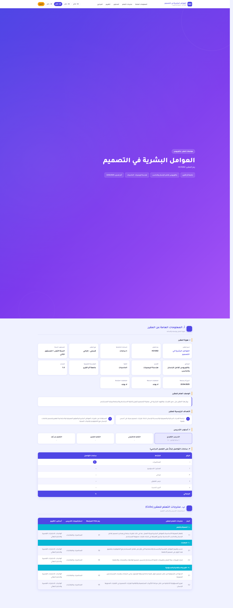{width=100%}

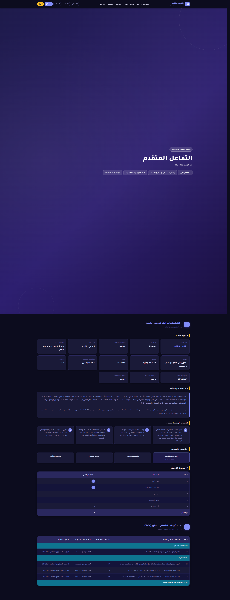{width=100%}

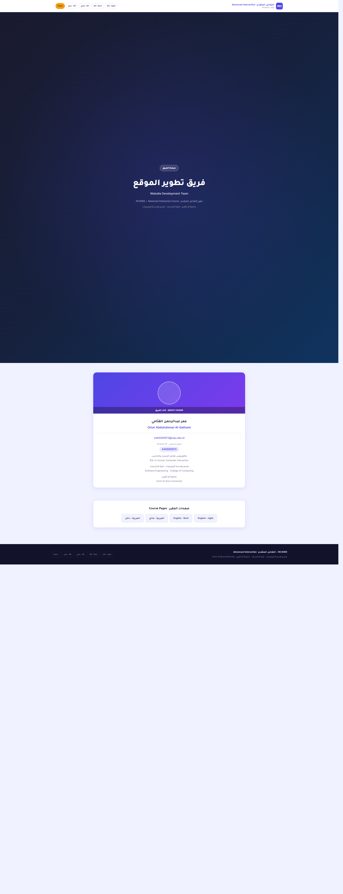{width=100%}

**Mobile Screenshots:**

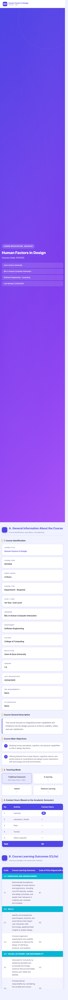{height=3.5in}

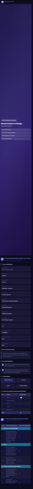{height=3.5in}

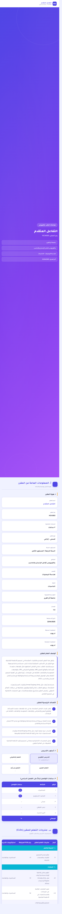{height=3.5in}

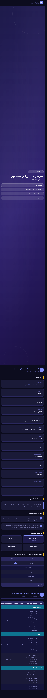{height=3.5in}

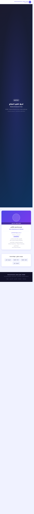{height=3.5in}

**GitHub Project Link:** [https://github.com/omavic9/HCI4303-Course-Website](https://github.com/omavic9/HCI4303-Course-Website)
